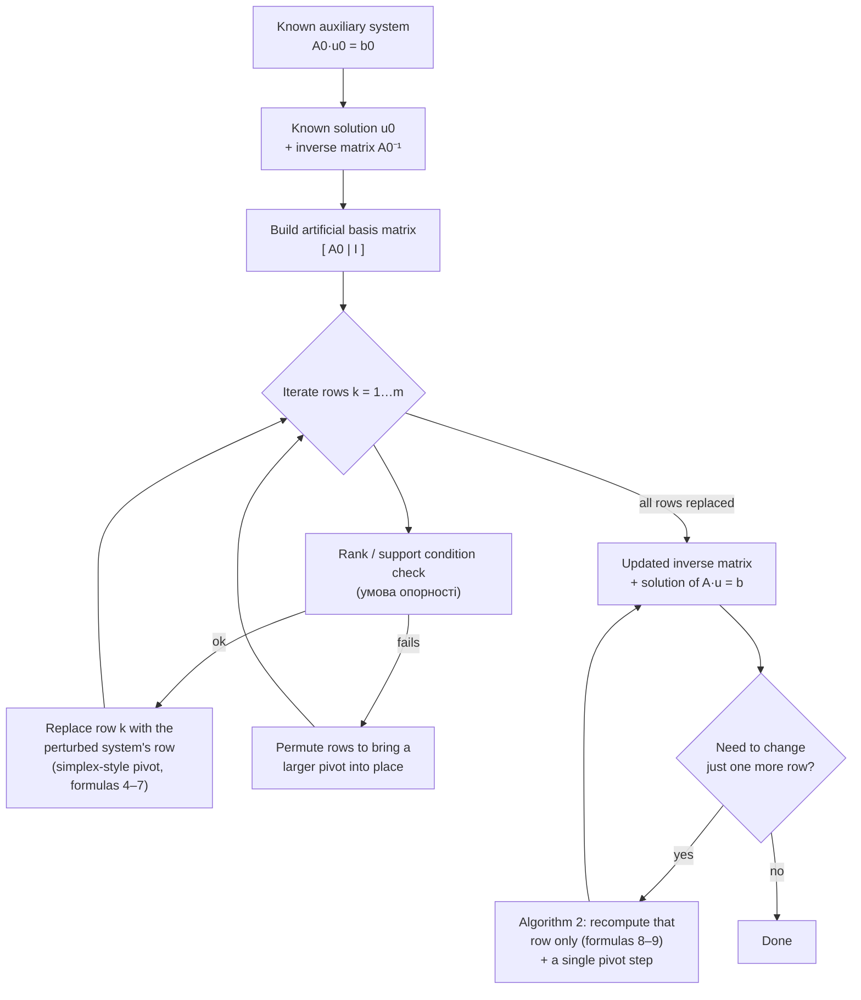
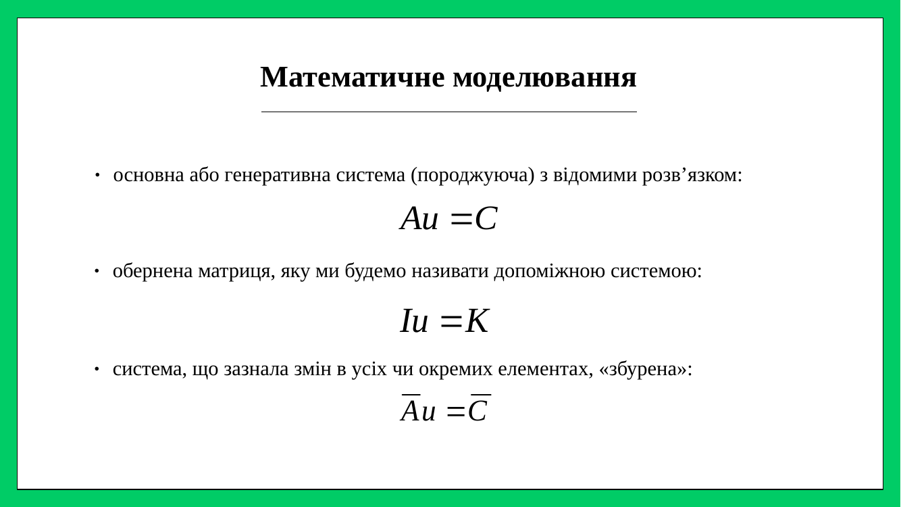
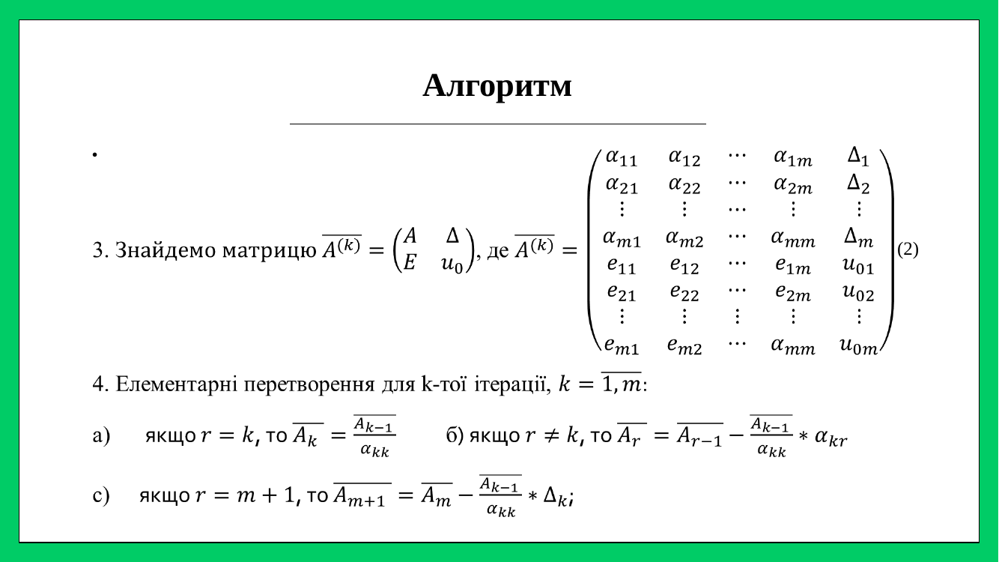
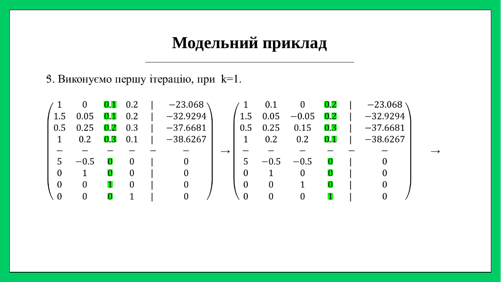
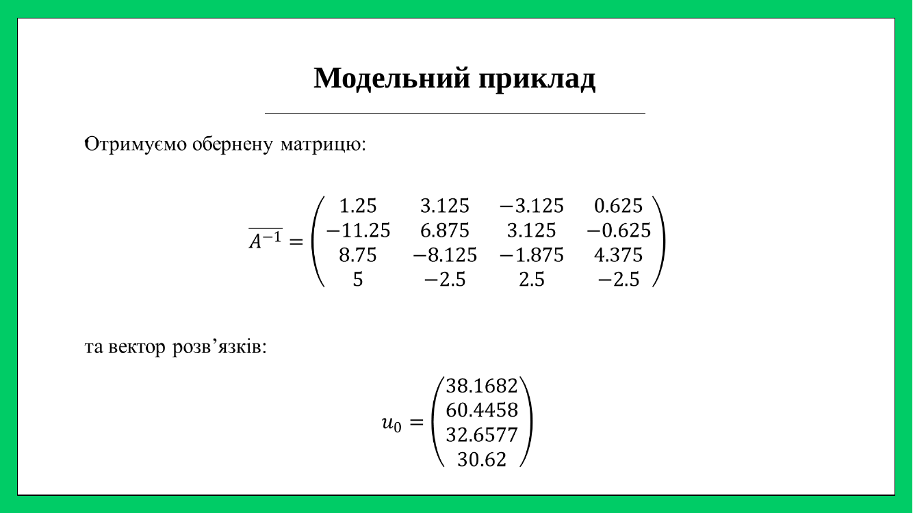

# 🧮 Matrix Pseudobasic Algorithms

**Матричні псевдобазисні алгоритми**

> 🎓 University Research / Conference Project · 2018
> 🗄️ Archived and curated as a portfolio repository · 2026

A method and reference C++ implementation for **recalculating the solution
of a linear system after its coefficients change — without solving the
system from scratch** 🔁, presented at the 5th International Conference
"Information Technology and Interactions" (ITI&I-2018) 🎤, Taras Shevchenko
National University of Kyiv 🇺🇦.

---

## 📖 About

🧮 A 2018 university research project on **matrix pseudobasis algorithms** — a
way to recalculate the solution of a linear system `A·u = b` after its
coefficients change, without solving the whole system again from zero. 🔁

💡 The core trick: keep the known solution and inverse matrix of a *related*
system on hand, then swap in the changed rows **one at a time**, using
simplex-style pivot steps ➕ rank/support checks at each iteration, until the
target system's inverse and solution fall out at the end. ⚙️

🎤 Presented at **ITI&I-2018**, the 5th International Conference "Information
Technology and Interactions," at Taras Shevchenko National University of
Kyiv 🇺🇦 — November 20–21, 2018.

🖥️ Includes the original C++ implementation, a portable rebuild that
compiles and runs today, worked numerical examples 📐, the defense
presentation 🖼️, and the full thesis text 📄 — all archived and documented
here in 2026 as a portfolio piece. 🗄️✨

## 📋 Summary

| | |
|---|---|
| **Title** | Matrix Pseudobasic Algorithms |
| **Authors** | М. М. Антоневич (student), В. І. Кудін (Dr. Sc. Tech., Prof.), А. М. Онищенко (Dr. Sc. Econ., Prof.) |
| **Institution** | Taras Shevchenko National University of Kyiv, Faculty of Information Technology |
| **Conference** | ITI&I-2018, Kyiv, November 20–21, 2018 |
| **Language** | Ukrainian (original); this README in English |
| **Original tooling** | C++ (MSVC/Windows-era), 2018 |
| **This repository** | Curated 2026 — see [Historical Context](#-historical-context) |

## 🧩 Problem statement

Many applied linear-algebra problems (economic input–output models,
engineering systems, resource allocation) come down to solving `A u = b`.
In practice, coefficients get revised — a technology changes, a price
updates, a constraint is tightened — and the natural instinct is to
re-solve the whole system from zero every time.

This project asks: if we already know the solution and inverse matrix of a
**related, known** ("auxiliary") system, can we fold in a change to the
**perturbed** ("target") system's coefficients cheaply, reusing that known
solution instead of starting over?

## 💡 Core idea: pseudobasic matrices

The method builds an **artificial (pseudobasic) basis matrix** out of rows
drawn from the known auxiliary system, then **iteratively replaces those
rows**, one at a time, with the corresponding rows of the perturbed
system — using simplex-style pivot relations. At each step a **rank** and
**support condition** check ensures the substitution stays valid. After all
rows have been replaced, what's left is the inverse matrix and solution of
the *target* system. A second procedure handles the common case of
changing just **one row** even more cheaply — a single pivot step instead
of a full run.

See [`docs/methodology.md`](docs/methodology.md) for the full mathematical
walkthrough (with the governing formulas (4)–(7) from the thesis) and
[`docs/algorithm.md`](docs/algorithm.md) for how the C++ implementation
maps onto it.

## 🔁 Algorithm flow



## 🧪 Sample input / output

Input (`examples/matr.txt`), the thesis's worked example — a 3×3 system:

```
3 3
8 2 5 1
0 2 3 1
4 1 1 1
```

(rows = coefficients of `8u1+2u2+5u3`, `2u2+3u3`, `4u1+u2+u3`, each `= 1`)

Running `matr_pseudobasic` against it and choosing not to perturb any row
reproduces the thesis's worked-example inverse matrix and solution vector
(see [`docs/methodology.md#6-worked-numerical-example-from-the-thesis`](docs/methodology.md)
and the handwritten derivation photos referenced in
[`docs/provenance.md`](docs/provenance.md)).

## 🛠️ Building and running

```bash
mkdir build && cd build
cmake .. && cmake --build .
./matr_pseudobasic          # matr.txt is copied next to the binary by CMake
```

Or directly with g++:

```bash
g++ -std=c++11 -O2 -o matr_pseudobasic src/matr_pseudobasic.cpp
cp examples/matr.txt .
./matr_pseudobasic
```

The program will print the pseudobasic-matrix iterations, the resulting
inverse matrix and solution, then prompt for a row index and new
coefficients to demonstrate the single-row recalculation feature.

## 🗂️ Repository map

```
.
├── src/matr_pseudobasic.cpp   # portable build of the canonical 2018 source
├── CMakeLists.txt
├── examples/                  # sample inputs (matr.txt, drib.txt)
├── archive/                   # untouched historical sources
│   ├── matr_konferentsia_new_original.cpp
│   └── cpp_drafts/            # earlier draft implementations + fraction-parser test
├── paper/thesis.docx          # full thesis text
├── presentation/Zakhyst_5.pptx
├── assets/                    # conference photos, results chart
└── docs/
    ├── methodology.md         # the math, independent of the code
    ├── algorithm.md           # code walkthrough
    ├── conference.md          # ITI&I-2018 details & citation
    └── provenance.md          # what's original vs. added in 2026
```

## 🎤 Conference participation

Presented in Section 1 (Mathematical Foundations of Information
Technology), room 310, on November 20, 2018, at ITI&I-2018, Kyiv. Full
details and citation in [`docs/conference.md`](docs/conference.md).

- 📄 Thesis text: [`paper/thesis.docx`](paper/thesis.docx)
- 🖥️ Presentation: [`presentation/Zakhyst_5.pptx`](presentation/Zakhyst_5.pptx) · 📕 [PDF export](presentation/Zakhyst_5.pdf)
- 📸 Photos & results chart: [`assets/`](assets)

**Slides on the pseudobasic-matrix method** (the group defense deck covers several sub-topics; these are the ones relevant to this repository):

| | |
|---|---|
|  |  |
|  |  |

## 🧰 Technologies used

| Then (2018) | Now (2026 curation) |
|---|---|
| C++ (MSVC / Windows) | Portable C++11, CMake |
| Manual console I/O | Same algorithm, unchanged logic |
| — | Markdown documentation, Mermaid diagram |

## 🕰️ Historical context

This was a 2018 undergraduate research project. The C++ source was written
against Windows-era MSVC tooling (`#include <windows.h>`, manual console
formatting) and read its input from a `matr.txt` file placed next to the
executable. **This repository was assembled in 2026**, years after the
original work, to make the project presentable and buildable on a modern
toolchain — it does not claim the original 2018 workflow used CMake,
Markdown docs, or any tooling introduced during curation. See
[`docs/provenance.md`](docs/provenance.md) for the precise, itemized
breakdown of what's original vs. added.

## ⚠️ Limitations

- The reference implementation is a direct, largely unmodified port of a
  student research prototype — it uses `atof`-based parsing, has minimal
  input validation, and is not hardened for production use.
- Original comments are in Ukrainian; due to a lost/ambiguous source
  encoding, they render as mojibake in modern UTF-8 tooling. Rather than
  guess at a "fix" that could introduce further corruption, they are left
  as-is; English explanations are provided in the `docs/` files instead.
- The method as implemented assumes a square, well-posed system at each
  step; the ill-conditioned-pivot handling described in the thesis is
  partially manual (row permutation) rather than fully automated.

## 📜 Provenance

See [`docs/provenance.md`](docs/provenance.md) for a full, itemized account
of what came from the original 2018 Google Drive folder versus what was
added or changed during 2026 curation, including which near-duplicate
drafts and unrelated materials were excluded and why.

## 📚 Citation

If referencing this work:

```
Антоневич М. М., Кудін В. І., Онищенко А. М. Матричні псевдобазисні
алгоритми // Інформаційні технології та взаємодії (ІТ&I-2018): Тези
доповідей V Міжнародної науково-практичної конференції, 20–21 листопада
2018 р. — Київ: Київський національний університет імені Тараса Шевченка,
2018.
```

See [`LICENSE`](LICENSE) for rights and reuse terms.
